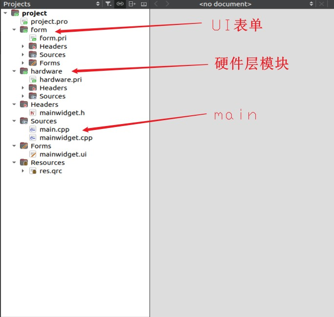
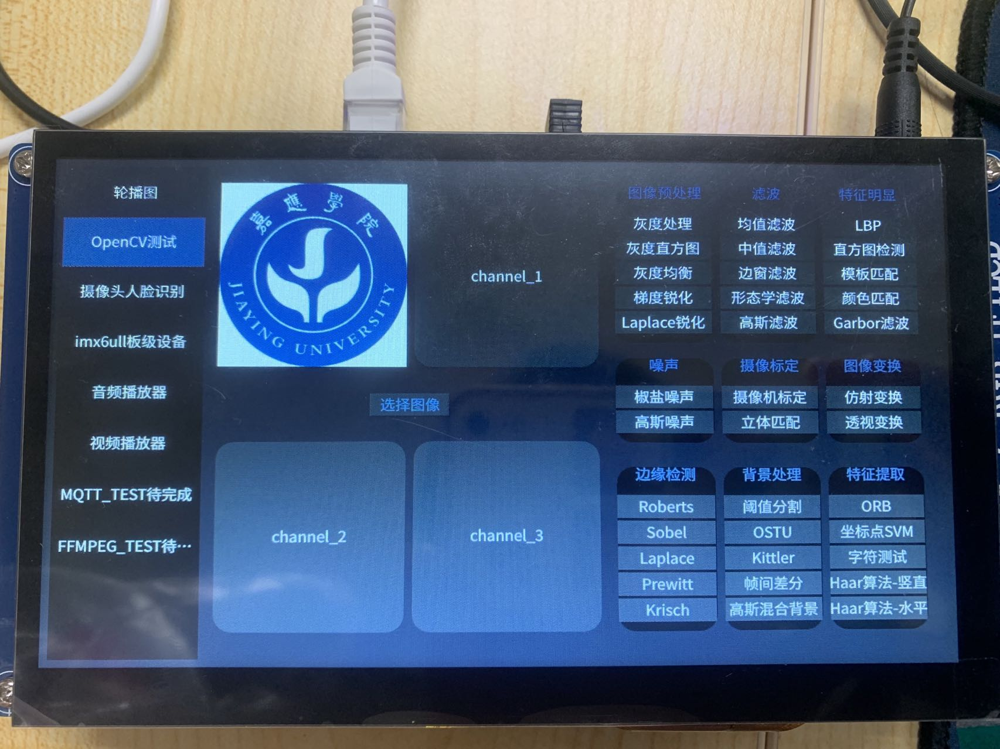
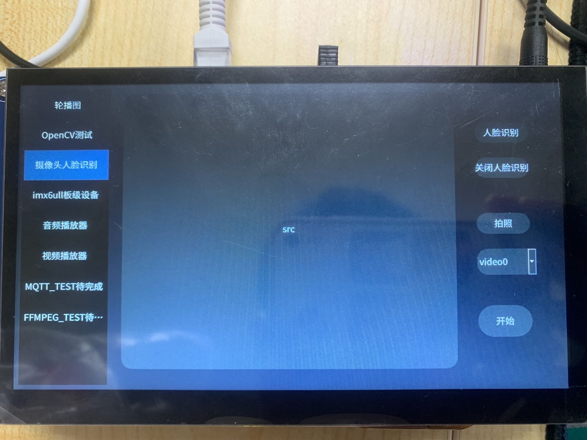
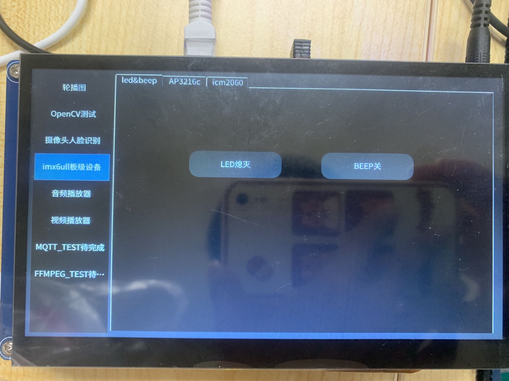
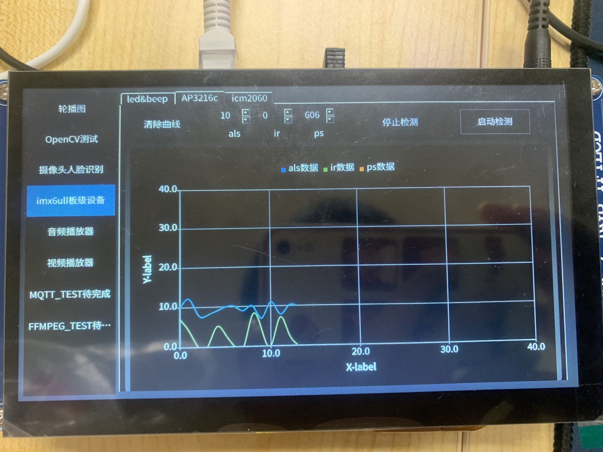
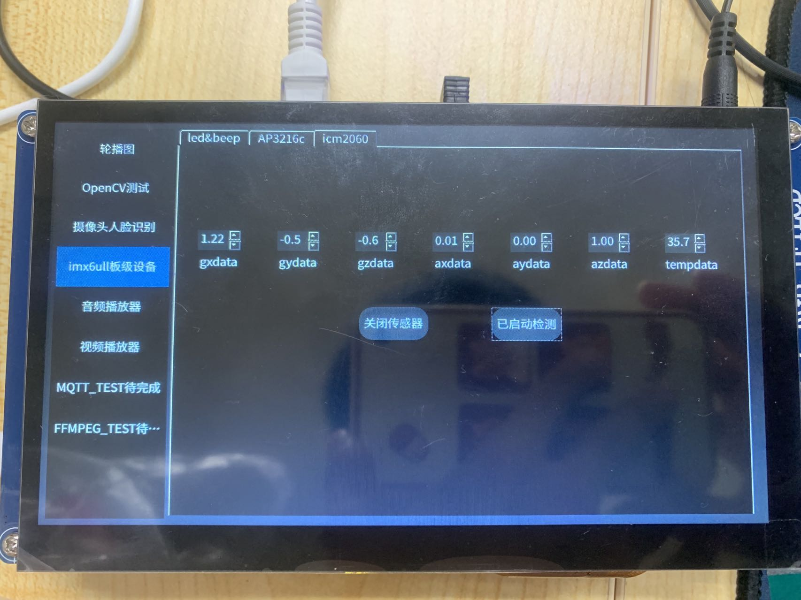
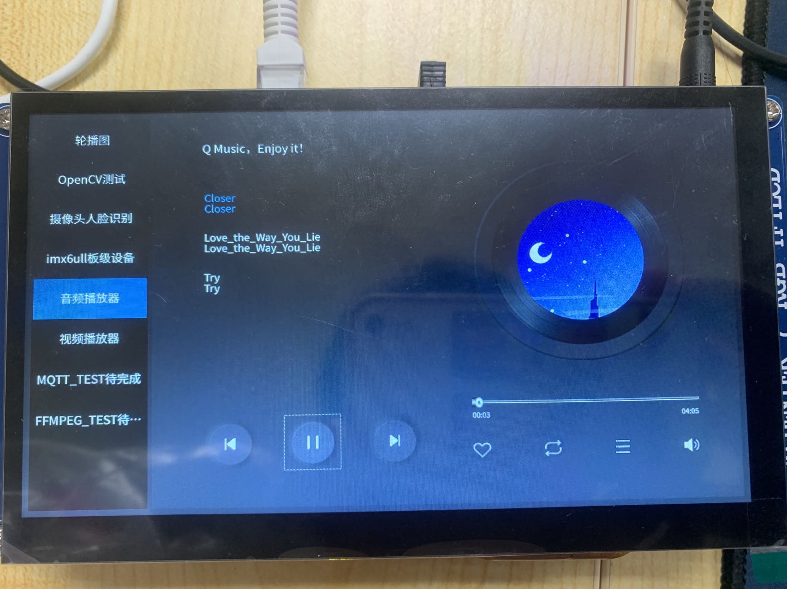
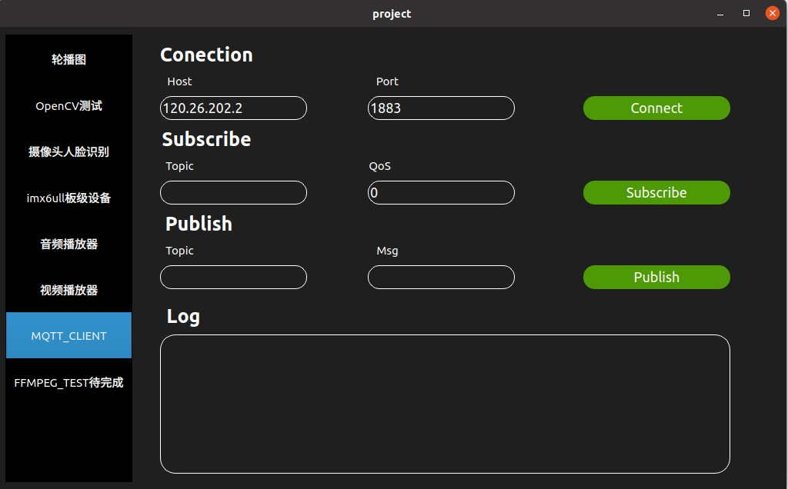

# imx6ull_project

>演示地址：https://www.bilibili.com/video/BV13o4y177KX/

## 概述

>该项目是为学习巩固**嵌入式Qt**而做，基于正点原子的imx6ull，里面分版块做了一系列功能集成，目的锻炼各个板块的能力，还有一个，该项目同时是**模块化开发**，各个模块可以非常方便移植。后续会做出更多板块在上面，敬请期待。

## 项目目的

>1. 锻炼个人**嵌入式Linux Qt开发能力**
>2. 集合各种模块，方便之后移植使用

## 功能概述

>1. 轮播图    已完成
>2. OpenCV    已完成
>3. 摄像头及人脸识别    已完成
>4. imx6ull板级硬件    已完成
>5. 音频播放器    已完成
>6. 视频播放器    已完成
>7. MQTT    已完成
>8. FFMPEG    待完成
>9. 可随意添加……

## QT项目架构

>**项目配置（config）**
>
>>.pro文件
>>
>>.pri文件
>>
>>config.h文件
>
>**硬件层（base层）**
>
>>提供连通硬件各种接口，底层接口
>>
>>**细分**
>>
>>>底层分类（根据个人习惯）
>
>**中间控制层（conCtol层）**
>
>>提供各种APP层需要的**接口（API）函数**
>>
>>**细分**
>>
>>>open sources(开源库)
>>>
>>>network（网络接口）
>>>
>>>hardware（硬件控制）
>>>
>>>media（媒体）
>>>
>>>……
>
>**APP层（UI表单层）**
>
>>APP层逻辑编写，如各种控制事件，UI交互逻辑
>>
>>**细分**
>>
>>>APP分类（根据个人习惯）
>
>**项目资源（sources）**
>
>>项目的资源管理，如图片，样式，字体库等等
>>
>>**细分**
>>
>>> img
>>>
>>> style
>>>
>>> font
>>>
>>> ……

> 最后的话：以上框架是我个人理解，每个人都有自己的style，仅做参考

## 项目图片

## 项目移植问题

>注意事项
>
>1. 动态库
>
>

## 开源项目推荐

>https://gitee.com/feiyangqingyun/QWidgetDemo
>
>