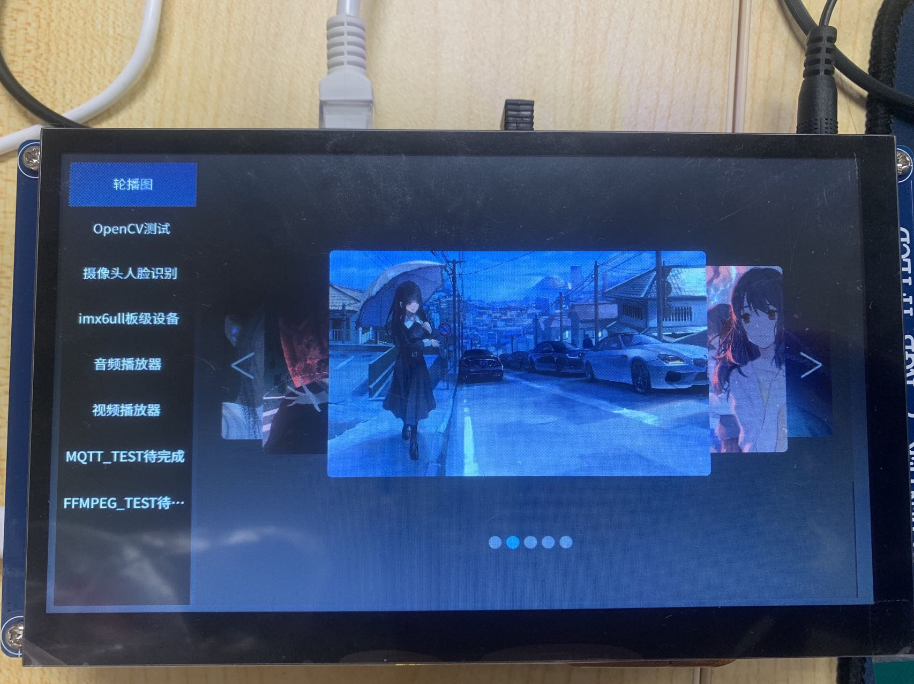

# imx6ull_project

>演示地址：

## 概述

>该项目是为学习巩固**嵌入式Qt**而做，基于正点原子的imx6ull，里面分版块做了一系列功能集成，目的锻炼各个板块的能力，还有一个，该项目同时是**模块化开发**，各个模块可以非常方便移植。后续会做出更多板块在上面，敬请期待。

## 项目目的

>1. 锻炼个人**嵌入式Linux Qt开发能力**
>2. 集合各种模块，方便之后移植使用

## 功能概述

>1. 轮播图    已完成
>2. OpenCV    已完成
>3. 摄像头及人脸识别    已完成
>4. imx6ull板级硬件    已完成
>5. 音频播放器    已完成
>6. 视频播放器    已完成
>7. MQTT    待完成
>8. FFMPEG    待完成

## 项目结构

## 项目图片

